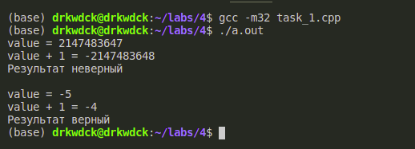
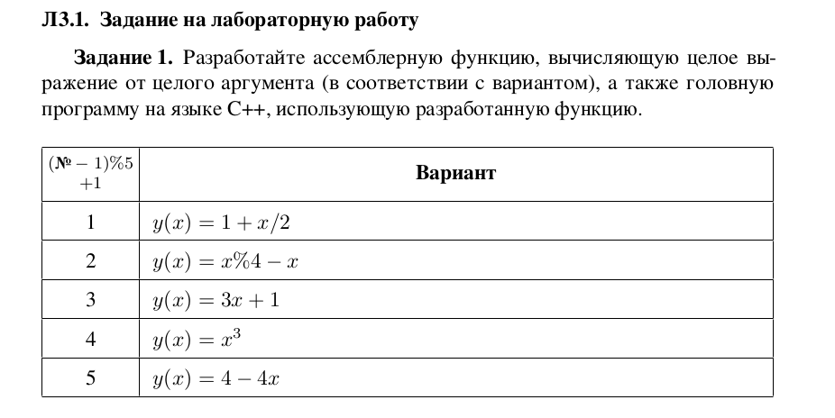
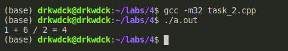
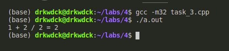
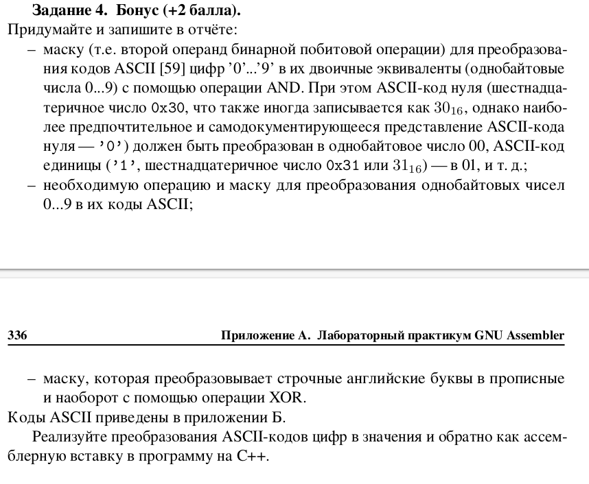
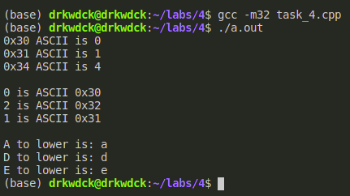

# Лаборатрная работа №4
# Задание 1
Разработайте и выполните программу, в которой реализуйте при
помощи ассемблерной вставки.\
Увеличение целого числа со знаком на 1 (инкремент)\
После команды сложения/вычитания проанализируйте соответствующий флаг
состояния процессора, и, в зависимости от его значения, выведите результат и строку *«Результат верный»* (если не было переполнения) или *«Результат неверный»*
(при переполнении).\
&nbsp;

### Код:
````cpp
#include <stdio.h>


void Add(int x)
{
    bool result = false;

    printf("value = %d\n", x);
    
    asm ( "add $1, %0\n" : "=r" (x) : "0" (x) );

    // Jump if not overflow  (jno)
    asm ( "jno notoverflow;"\
    "mov $0x1,%0;"\
    "notoverflow :"\
    : "=r" (result) : "0" (result) );
    
    printf("value + 1 = %d\n", x);
    
    
    if (result == true)
    {
        printf("Результат неверный\n");
    }
    else
    {
        printf("Результат верный\n");
    }
}

int main(void)
{
    // int max value
    int max_int = 2147483647;
    int some_number = -5;

    Add(max_int);

    printf("\n");
    Add(some_number);
    
    return 0;
}
````
### Результат выполнения:

# Задание 2
Реализуйте задание лабораторной работы Л3 (см. раздел Л3.1, задание 1) как ассемблерную вставку в программу на C++.

### Код
````cpp
#include <stdio.h>

int main()
{
    // y = 1 + x / 2
    int x = 6;
    int y;

    asm("sar $1, %0" : "=r" (y) : "0" (x));
    asm("add $1, %0" : "=r" (y) : "0" (y));

    printf("1 + %d / 2 = %d\n", x, y);
}
````
### Результат выполнения:

# Задание 3
Реализуйте задание 2, не используя в тексте вставки конкретных
имён регистров.
### Код
````cpp
#include <stdio.h>

int main()
{
    // y = 1 + x / 2
    int y = 2;
    int x = y;

    asm("sar $1, %[y]" :[y]"+r"(y));
    asm("add $1, %0" : [y]"+r"(y));

    printf("1 + %d / 2 = %d\n", x, y);
}
````
### Результат выполнения:

# Задание 4 (доп)

### Код
````cpp
#include <stdio.h>

// Первый пункт
void ASCIIToNumber(unsigned int ascii_number)
{
    unsigned int result;

    asm ( "and $0x0F, %0" : "=r" (result) : "0" (ascii_number));
    printf("0x%X ASCII is %u\n", ascii_number, result);
}

// Второй пункт
void NumberToASCII(unsigned int number)
{
    unsigned int result;

    asm ( "xor $0x30, %0" : "=r" (result) : "0" (number));
    printf("%u is ASCII 0x%X \n", number, result);
}

// Третий пункт
void ToLower(unsigned int symbol)
{
    unsigned int result;

    asm ( "xor $0x20, %0" : "=r" (result) : "0" (symbol));
    printf("%c to lower is: %c \n", symbol, result);
}

int main()
{
    ASCIIToNumber(0x30);
    ASCIIToNumber(0x31);
    ASCIIToNumber(0x34);
    
    printf("\n");

    NumberToASCII(0);
    NumberToASCII(2);
    NumberToASCII(1);

    printf("\n");

    ToLower('A');
    ToLower('D');
    ToLower('E');

    return 0;
}
````
### Результат выполнения

