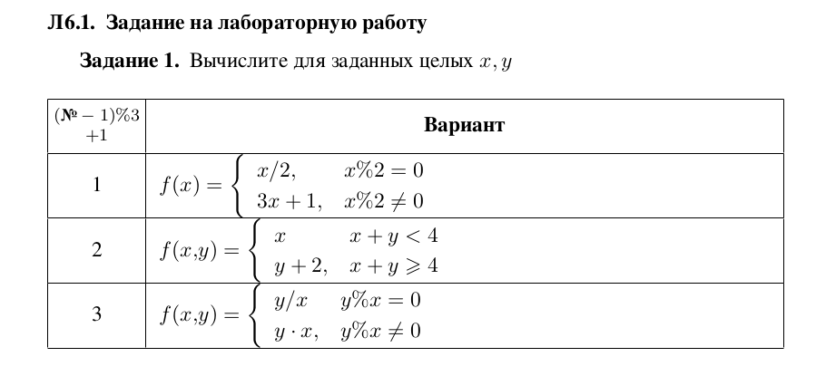
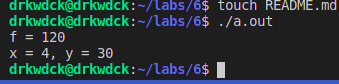
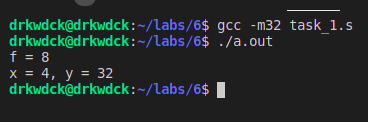

# Лаборатрная работа №6
## ПМ-31
Шувалова Виктория, Сахно Андрей, Решетников Егор
### Вариант 6

# Задание 1
\
&nbsp;

Код
```
.data
    printf_format:
        .string "f = %d\nx = 4, y = 30\n"
    x:
        .int 4
    y:
        .int 30
.globl main
    main:
        movl y, %eax
        movl x, %ebx
        xor %edx, %edx
        idiv %ebx

        cmpl $0, %edx
        jne y_mod_x_not_zero
        
        pushl %eax
        pushl $printf_format
        call printf
        jmp end

    y_mod_x_not_zero:
        movl x, %eax
        movl y, %edx
        mul %edx
        pushl %eax
        pushl $printf_format
        call printf
    end:
        addl $8, %esp
        movl $0, %eax
        movl $0, %edx
        ret
```
### Для запуска
Из директории с 6 лабой:
````console
$gcc -m32 task_1.s 
$./a.out 
````


Результат\

&nbsp;

С другими параметрами
&nbsp;


