# Лаборатрная работа №6
## ПМ-31
Шувалова Виктория, Сахно Андрей, Решетников Егор
### Вариант 6

# Задание 1
\
&nbsp;
### 3 вариант

Код
```
.data
    printf_format:
        .string "f = %d\nx = 4, y = 30\n"
    x:
        .int 4
    y:
        .int 30
.globl main
    main:
        movl y, %eax
        movl x, %ebx
        xor %edx, %edx
        idiv %ebx

        cmpl $0, %edx
        jne y_mod_x_not_zero
        
        pushl %eax
        pushl $printf_format
        call printf
        jmp end

    y_mod_x_not_zero:
        movl x, %eax
        movl y, %edx
        mul %edx
        pushl %eax
        pushl $printf_format
        call printf
    end:
        addl $8, %esp
        movl $0, %eax
        movl $0, %edx
        ret
```
### Для запуска
Из директории с 6 лабой:
````console
$gcc -m32 task_1.s 
$./a.out 
````


Результат\

&nbsp;

С другими параметрами
&nbsp;


# Задание 2

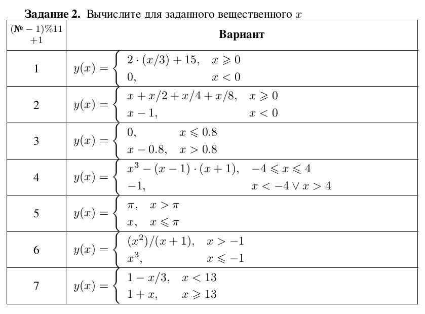\
&nbsp;
### 7 вариант

Код
```
.data
    printf_format:
        .string "y = %f\nx = 15\n"
    x:
        .double 15
    y:
        .double 0
    a:
        .double 1
    b:
        .double -13
    c:
        .double 3
.globl main
    main:
        fldl x
        fldl b
        fadd
        ftst
        fstsw %ax
        sahf
        jbe less_than_13

        fldl c
        fldl x
        fdiv
        fldl a
        fsub

        jmp end
        less_than_13:
        fldl x
        fldl a
        fadd
        end:
        fstpl (y)
        pushl (y+4)
        pushl (y)
        push $printf_format
        call printf
        add $12, %esp
        ret
```
### Для запуска
Из директории с 6 лабой:
````console
$gcc -m32 -lm task_2.s
$./a.out 
````
Результат\
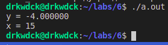
&nbsp;

С другими параметрами
&nbsp;

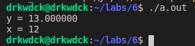
# Задание 3

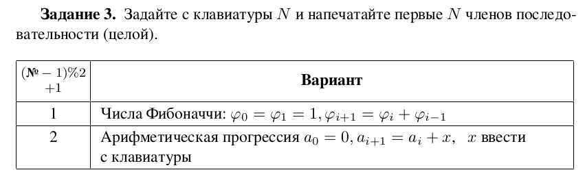\
&nbsp;
### 2 вариант

Код
```
.data
    input: 
        .string "%d"
    output:
        .string "a(%d)=%d\n"
    input_N_message:
        .string "Enter N: "
    input_x_message:
        .string "Enter x: "
    x:
        .int 0
    N:
        .int 0
    i:
        .int -1
    sequence:
        .int 0
.globl main
    main:
        pushl %ebp
        movl %esp, %ebp
        subl $40, %esp
        movl $input_x_message, (%esp)
        call printf
        leal 36(%esp), %eax
        movl %eax, 4(%esp)
        movl $input, (%esp)
        call scanf
        movl -4(%ebp), %eax
        movl %eax, x
        movl %ebp, %esp
        popl %ebp
        pushl %ebp
        movl %esp, %ebp
        subl $40, %esp
        movl $input_N_message, (%esp)
        call printf
        leal 36(%esp), %eax
        movl %eax, 4(%esp)
        movl $input, (%esp)
        call scanf
        movl -4(%ebp), %eax
        movl %eax, N
        movl %ebp, %esp
        popl %ebp
    start_step:
        cmpl $0,N
        je end_loop
        addl $-1, N
        addl $1, i
    end_step:
        push sequence
        push sequence
        push i
        push $output
        call printf
        addl $16, %esp
        movl x, %eax
        addl %eax, sequence
        jmp start_step
    end_loop:
        ret
```
### Для запуска
Из директории с 6 лабой:
````console
$gcc -m32 -lm task_3.s
$./a.out 
````
Результат\
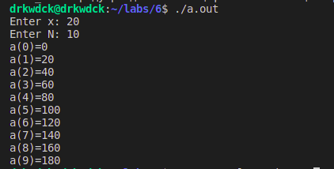
&nbsp;

С другими параметрами
&nbsp;

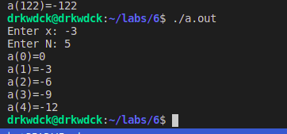
# Задание 4

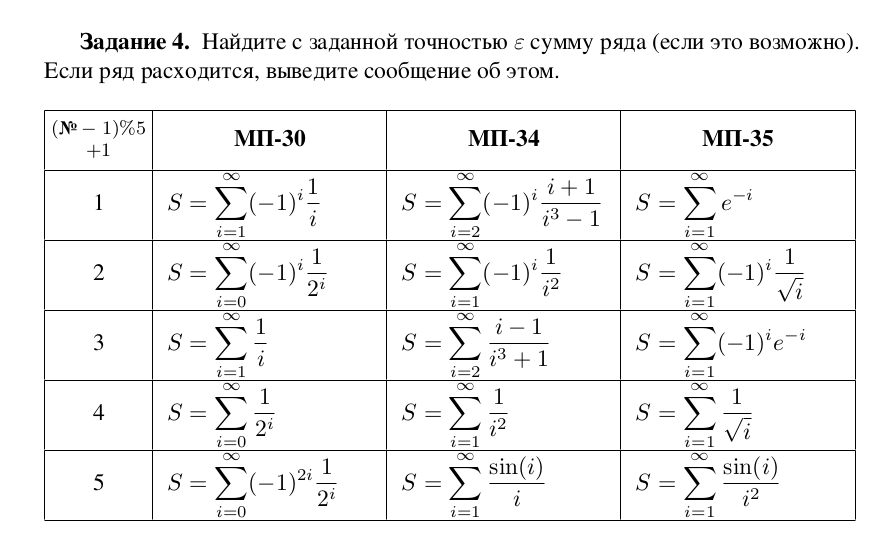\
&nbsp;
### Раньше мы были МП-30, вариант 1
Точность будем проверять по следствию из теоремы Лейбница, которое гласит, что разница между частичной суммой и суммой ряда меньше модуля первого отброшенного члена.
Код
```
.data
    output:
        .string "S = %f\n"
    epsilon:
        .double 0.2
    i:
        .double 1
    S:
        .double -1
    a:
        .double -1
    one:
        .double 1
    sign:
        .double -1
.globl main
    main:
        start:
        fldl one
        fldl i
        fadd
        fstpl (i)

        fldl sign
        fchs
        fstpl (sign)

        fldl i
        fldl sign
        fdiv
        fstpl (a)

        fldl a
        fabs
        fldl epsilon
        fabs
        fsubr
        ftst
        fstsw %ax
        sahf
        jbe end

        fldl S
        fldl a
        fadd
        fstpl (S)
        jmp start

        end:
        pushl (S+4)
        pushl (S)
        push $output
        call printf
        add $12, %esp
        ret
```

### Для запуска
Из директории с 6 лабой:
````console
$gcc -m32 task_4.s
$./a.out 
````
Результат\
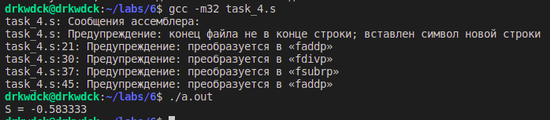
&nbsp;

Напишем код, на C++ для проверки:
````cpp
#include "stdio.h"
#include <cmath>

int main()
{
    double epsilon = 0.2;
    double a = 0;
    double S = 0;
    double i = 0;

    while (true)
    {
        ++i;
        a = pow(-1.0, i) / i;
        if ((a < 0 ? a * (-1) : a) <= epsilon) { break; }
        S += a;
    }

    printf("S = %f\n", S);

    return 0;
}
````

### Для запуска
Из директории с 6 лабой:
````console
$gcc -m32 task_4.cpp -lm 
$./a.out 
````
Результат\
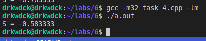
&nbsp;
# Задание 5

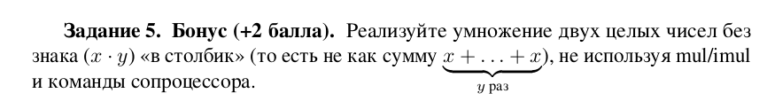\
&nbsp;

Код
````cpp
#include "stdio.h"

int main()
{
    int x = 7, y = -4;
    int result;
    int immutable_x = x; 
    int immutable_y = y; 

    asm (
        "xor %%eax,%%eax\n"
        "mov $0x10,%%ecx \n"
        "a0: \n"
        "cmp $0,%[X] \n"
        "jz a3 \n"
        "shr $1,%[X] \n"
        "jnc a2 \n"
        "add %[Y],%%eax \n"
        "a2: \n"
        "add %[Y],%[Y] \n"
        "jnz a0 \n"
        "dec %%eax\n"
        "a3:\n"
        "movl %%eax, %[result]\n"
        : [result]"=m" (result),[X]"+r" (x),[Y]"+r"(y) :: "cc","%ecx","%eax"
    );

    printf("%d * %d = %d\n", immutable_x, immutable_y, result);
    return 0;
}
````

### Для запуска
Из директории с 6 лабой:
````console
$gcc -m32 task_5.cpp -lm 
$./a.out 
````
Результат с разными параметрами\
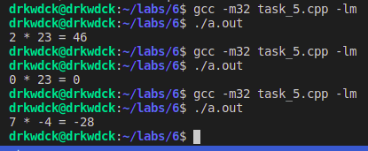
&nbsp;