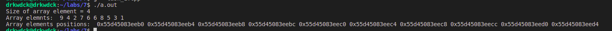
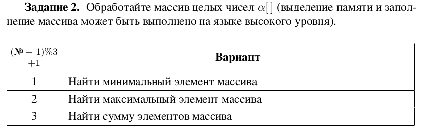
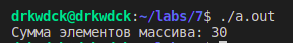
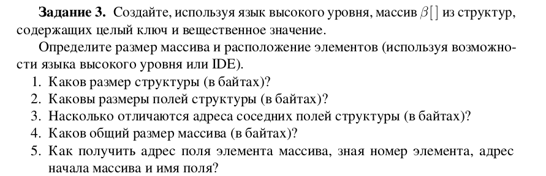
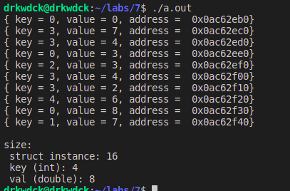
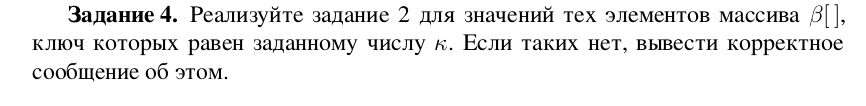
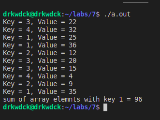
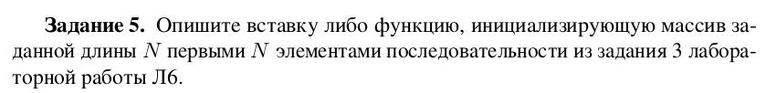
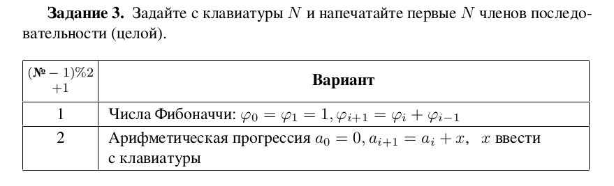
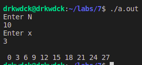

# Лаборатрная работа №7
## ПМ-31
Шувалова Виктория, Сахно Андрей, Решетников Егор
### Вариант 6

# Задание 1


&nbsp;

Код
````cpp
#include <iostream>
#include <stdio.h>
#include <stdlib.h>
#include <time.h>

int main()
{
    srand(87);
    int N = 10;
    int * array = new int[N];
    std::cout << "Size of array element = "<< sizeof(array[0]) << std::endl;
    std::cout << "Array elemnts: ";

    for (int i = 0; i < N; ++i)
    {
        array[i] = rand() % N;
        std::cout << " " << array[i];
    }

    std::cout << "\nArray elements positions: ";

    for (int i = 0; i < N; ++i)
    {
        std::cout << " " << &(array[i]); 
    }


    std::cout << "\n";
    delete [] array;
    return 0;
}
````

### Для запуска
Из директории с 7 лабой:
````console
$ g++ task_1.cpp
$ ./a.out 
````
Результат\


### Ответы на вопросы
* Каков размер элемента (в байтах)?
  + 4
* Насколько отличаются адреса соседних элементов массива (в байтах)?
  + на 5
* Каков общий размер массива (в байтах)?
  + общий размер равен произведению размера элемента массива на кол-во его элементов
* Как получить адрес элемента массива, зная его номер и адрес начала массива?
  + адрес = начало массива + номер элемента * размер элемента 

# Задание 2
### Вариант 3
\
&nbsp;

Код
````
.data
output_format:
    .string "Сумма элементов массива: %d\n"
array:
    .int 1, 2, 3, 4, 5, 6, 9
array_end:
    .globl main
main:
    movl array, %eax
    movl $array+4, %ebx
    jmp checkForEnd
action:
    add (%ebx), %eax
    addl $4, %ebx
checkForEnd:
    cmpl $array_end, %ebx
    jne action
    pushl %eax
    pushl $output_format
    call printf
    addl $8, %esp
    movl $0, %eax
ret
````

### Для запуска
Из директории с 7 лабой:
````console
$ gcc -m32 task_2.s
$ ./a.out 
````
Результат\


# Задание 3


&nbsp;

Код
````cpp
#include <iostream>
#include "stdlib.h"

struct Foo
{
    int key;
    double value;
};

int main()
{
    srand(10);
    int N = 10;
    struct Foo * array = new struct Foo[N];

    for (int i=0 ; i<N ; i++)
    {
        array[i].key=rand()%(N/2);
        array[i].value=(rand()%1000)/(double)100;
        printf("{ key = %d, value = %.f, address =  %#010x} \n",array[i].key ,array[i].value, &(array[i]));
    }

    printf("\nsize: \n struct instance: %d\n key (int): %d\n val (double): %d\n",sizeof(array[0]),sizeof(array[0].key),sizeof(array[0].value));
    delete [] array;
    return 0;
}
````

### Для запуска
Из директории с 7 лабой:
````console
$ g++ task_3.cpp
$ ./a.out 
````

Результат\


### Ответы на вопросы
* Каков размер структуры (в байтах)?
  + 12, но для выравнивания увеличивается до 16.
* Каковы размеры полей структуры (в байтах)?
  + Ключ: 4, значение: 8
* Насколько отличаются адреса соседних полей структуры (в байтах)?
  + На 16 байт
* Каков общий размер массива (в байтах)?
  + Он равен произведению кол-ва элементов массива, на размер элемента (оба множителя нам известны)
* Как получить адрес поля элемента массива, зная номер элемента, адрес
начала массива и имя поля?
  + Ключ лежит по адресу элемента (с него начинается объект в памяти)
  + Значение лежит по адресу элемента плюс смещение на размер ключа

# Задание 4


&nbsp;

Код
```cpp
#include <iostream>
#include <stdio.h>
#include <stdlib.h>
#include <time.h>

struct KeyValuePair
{
    int key;
    int value;
};

int main()
{
    srand(13);
    int N = 10;
    struct KeyValuePair * array = new struct KeyValuePair[N];

    for (int i = 0 ; i < N ; ++i)
    {
        array[i].key=rand()%4+1;
        array[i].value=rand()%(40)+1;
        printf("Key = %d, Value = %d\n",array[i].key,array[i].value);
    }

    int key = 1;
    int sum = 0;
    asm (
        "movl $1, %%eax\n\t"
        "movl $0, %%ebx\n\t"
        "movl $0, %%eax\n\t"
        "Start:\n\t"
        "cmpl %[N], %%eax\n\t"
        "je Exit\n\t"
        "movl %[intArray], %%ecx\n\t"
        "leal (%%ecx, %%eax, 8), %%ecx\n\t"
        "movl (%%ecx),%%ecx\n\t"
        "cmpl %[key],%%ecx\n\t"
        "jne isOurKey\n\t"
        "movl %[intArray], %%ecx\n\t"
        "leal 4(%%ecx, %%eax, 8), %%ecx\n\t"
        "movl (%%ecx),%%ecx\n\t"
        "addl %%ecx, %%ebx\n\t"
        "isOurKey: \n\t"
        "incl %%eax\n\t"
        "jmp Start\n\t"
        "Exit:\n\t"
        "movl %%ebx, %[sum]\n\t"
        : [sum]"+m" (sum)
        : [intArray]"m" (array), [N]"m"(N),[key]"m"(key)
        : "cc","%eax","%ebx","%ecx"
    );

    if (sum == 0)
    {
        std::cout << "array does not contain elements with key: " << key << " or sum is 0" << std::endl;
    }
    else
    {
        std::cout << "sum of array elemnts with key "<< key << " = " << sum << std::endl;
    }

    delete [] array;
    return 0;
}
```
### Для запуска
Из директории с 7 лабой:
````console
$ g++ -m32 task_4.cpp
$ ./a.out 
````


Результат\


# Задание 5


&nbsp;

### Задание 3 из 6 лабораторной работы


&nbsp;

Код
```cpp
#include <iostream>
#include <stdio.h>
#include <stdlib.h>
#include <time.h>


int main()
{
    int i = 10; 
    int ai = 0;
    int x = 1;
    std:: cout << "Enter N\n";
    std::cin >> i;
    std::cout << "Enter x\n";
    std::cin >> x;
    srand(22);
    int N = i;
    int * array = new int [N];

    for (int i = 0; i < N; ++i)
    {
        array[i] = 0;
    }

    std::cout << std::endl;

    asm(
    "movl $0, %%ebx\n\t"
    "begin: \n"
    "cmpl %[i], %%ebx\n\t"
    "jz end\n"
    "movl %[ai],%%eax\n"
    "movl %[array], %%ecx\n\t"
    "movl %%eax,(%%ecx, %%ebx, 4)\n\t"

    "addl %[x],%%eax\n"
    "movl %%eax, %[ai]\n"
    "incl %%ebx\n\t"
    "jmp begin\n"
    "end: \n"
    :[ai]"+r"(ai),[x]"+r"(x),[i]"+r"(i)
    :[array]"m"(array)
    :"cc","%eax","%ecx","%ebx"
    );
    
    for (int i = 0; i < N; ++i)
    {
        std::cout << " " << array[i];
    }

    std::cout << "\n";

    return 0;
}
```

### Для запуска
Из директории с 7 лабой:
````console
$ g++ -m32 task_5.cpp 
$ ./a.out 
````

Результат\


