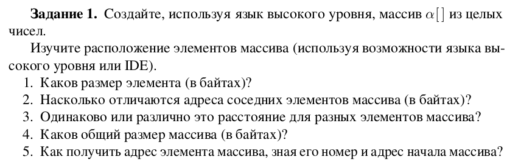

# Лаборатрная работа №7
## ПМ-31
Шувалова Виктория, Сахно Андрей, Решетников Егор
### Вариант 6

# Задание 1
\
&nbsp;


# Задание 2
### Вариант 3
\
&nbsp;

Код
````
.data
output_format:
    .string "Сумма элементов массива: %d\n"
array:
    .int 1, 2, 3, 4, 5, 6, 9
array_end:
    .globl main
main:
    movl array, %eax
    movl $array+4, %ebx
    jmp checkForEnd
action:
    add (%ebx), %eax
    addl $4, %ebx
checkForEnd:
    cmpl $array_end, %ebx
    jne action
    pushl %eax
    pushl $output_format
    call printf
    addl $8, %esp
    movl $0, %eax
ret
````

### Для запуска
Из директории с 7 лабой:
````console
$ gcc -m32 task_2.s
$ ./a.out 
````
Результат\


# Задание 3


&nbsp;

Код
````cpp
#include <iostream>
#include "stdlib.h"

struct Foo
{
    int key;
    double value;
};

int main()
{
    srand(10);
    int N = 10;
    struct Foo * array = new struct Foo[N];

    for (int i=0 ; i<N ; i++)
    {
        array[i].key=rand()%(N/2);
        array[i].value=(rand()%1000)/(double)100;
        printf("{ key = %d, value = %.f, address =  %#010x} \n",array[i].key ,array[i].value, &(array[i]));
    }

    printf("\nsize: \n struct instance: %d\n key (int): %d\n val (double): %d\n",sizeof(array[0]),sizeof(array[0].key),sizeof(array[0].value));
    delete [] array;
    return 0;
}
````

Результат\


### Ответы на вопросы
* Каков размер структуры (в байтах)?
  + 12, но для выравнивания увеличивается до 16.
* Каковы размеры полей структуры (в байтах)?
  + Ключ: 4, значение: 8
* Насколько отличаются адреса соседних полей структуры (в байтах)?
  + На 16 байт
* Каков общий размер массива (в байтах)?
  + Он равен произведению кол-ва элементов массива, на размер элемента (оба множителя нам известны)
* Как получить адрес поля элемента массива, зная номер элемента, адрес
начала массива и имя поля?
  + Ключ лежит по адресу элемента (с него начинается объект в памяти)
  + Значение лежит по адресу элемента плюс смещение на размер ключа